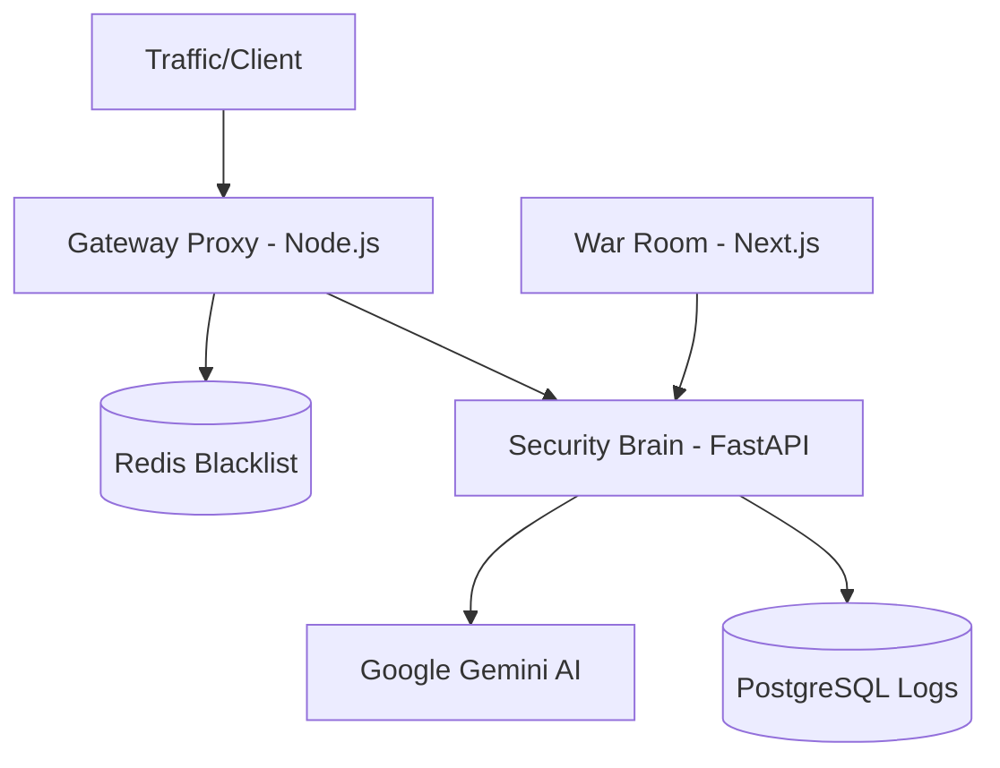

# GHOST-PROTOCOL 🛰️ | Autonomous Cyber-Defense System

O **GHOST-PROTOCOL** é um sistema de defesa cibernética agêntica de elite, projetado para interceptar, analisar e mitigar ameaças em tempo real utilizando Inteligência Artificial.

O sistema atua como um Proxy Reverso inteligente que "pensa" antes de permitir o tráfego, banindo IPs maliciosos instantaneamente através de uma arquitetura distribuída de microserviços.

## 📊 Arquitetura do Sistema



O ecossistema é composto por 3 microserviços orquestrados via Docker:

1.  **Gateway Proxy (Node.js/TypeScript)**: A linha de frente. Intercepta requisições, checa blacklists no Redis e bloqueia ataques conhecidos com latência zero.
2.  **Security Brain (Python/FastAPI)**: O cérebro analítico. Utiliza **Google Gemini 2.0 Flash** para analisar payloads suspeitos e decidir ações de mitigação. Possui modo de fallback heurístico integrado.
3.  **War Room Dashboard (Next.js 14)**: A torre de controle. Interface cyberpunk de alta performance para monitoramento de tráfego, níveis de ameaça e status do escudo.

## 🛠️ Tecnologias Utilizadas

-   **Backend**: Node.js, TypeScript, Fastify, Python 3.11, FastAPI.
-   **Inteligência Artificial**: Google Gemini 2.0 Flash (SDK Generative AI).
-   **Mensageria & Cache**: Redis (Blacklist em tempo real).
-   **Banco de Dados**: PostgreSQL (Logs de Auditoria).
-   **Frontend**: Next.js 14, Tailwind CSS, Framer Motion, Lucide Icons.
-   **Infraestrutura**: Docker, Docker Compose.

## 🧠 Diferenciais Técnicos

-   **Autonomous Mitigation**: O sistema decide e aplica bloqueios de IP de forma autônoma (Firewall dinâmico).
-   **AI Fallback Mode**: Se a API de IA falhar ou atingir limites de quota, o sistema ativa uma heurística local de segurança para manter a proteção (Resiliência).
-   **Observabilidade em Tempo Real**: Dashboard estilo "War Room" com polling otimizado e feedback visual de ataques.
-   **Arquitetura Poliglota**: Demonstra integração transparente entre Node.js (E/S intensiva) e Python (IA/Dados).

## 📦 Como Executar

1.  **Clone o repositório**:
    ```bash
    git clone https://github.com/seu-usuario/ghost-protocol.git
    cd ghost-protocol
    ```

2.  **Configure as variáveis de ambiente**:
    Copie o arquivo `.env.example` para `.env` e insira sua `GEMINI_API_KEY`.

3.  **Suba a infraestrutura via Docker**:
    ```bash
    docker-compose up --build
    ```

4.  **Acesse as interfaces**:
    -   **Dashboard**: `http://localhost:3000`
    -   **API Brain (Docs)**: `http://localhost:8000/docs`
    -   **Gateway**: `http://localhost:4000/api/resource`

5.  **Simule ataques para testar**:
    Utilize o botão **"Test Attack"** diretamente no Dashboard ou execute:
    ```bash
    python simulate_attack.py
    ```

---
*Desenvolvido por wilson borges.*
